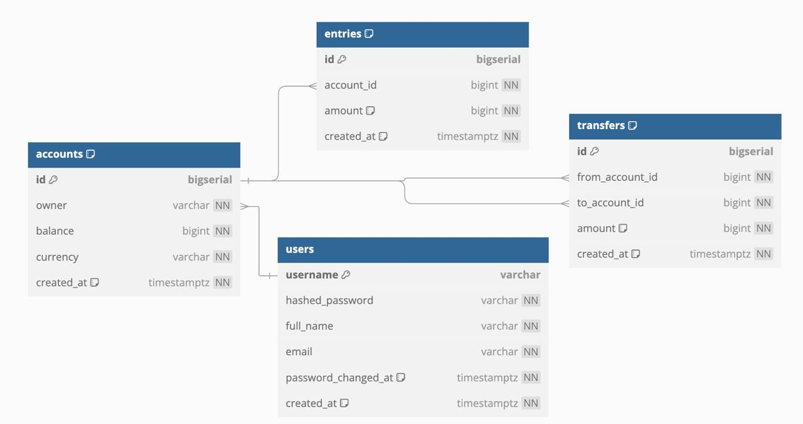

Данный сервис — это простой пример банковской системы. Он предоставляет API-интерфейсы для фронтенда, чтобы выполнять следующие действия:

- Создавать и управлять банковскими счетами, состоящими из имени владельца, баланса и валюты.
- Записывать все изменения баланса для каждой счета. Таким образом, каждый раз, когда на счет добавляются или списываются деньги, будет создаваться запись об изменении состояния счёта.
- Выполнять денежный перевод между двумя счетами. Это происходит внутри транзакции.

Схема БД: https://dbdiagram.io/d/Simple-Bank-67a02f0e263d6cf9a0cb4365 

DB documentation: https://dbdocs.io/madwave.1312/simple_bank 




#### Правила авторизации

- пользователь может создать банковский счёт только для себя
- пользователь должен иметь возможность получить только тот банковский счёт (или их список), которым он владеет


Создание миграций

```brew install golang-migrate```

```brew install kyleconroy/sqlc/sqlc```

```sqlc init```

Docker команды

```docker start postgres12```

```docker stop postgres12```

---------------------------------------

```select * from schema_migrations;```

```update schema_migrations 
set dirty = false
where dirty = true;```


------------------

make sqlc -> make mock


```dbdocs password --set secret --project simple_bank``` - set password to dbdocs